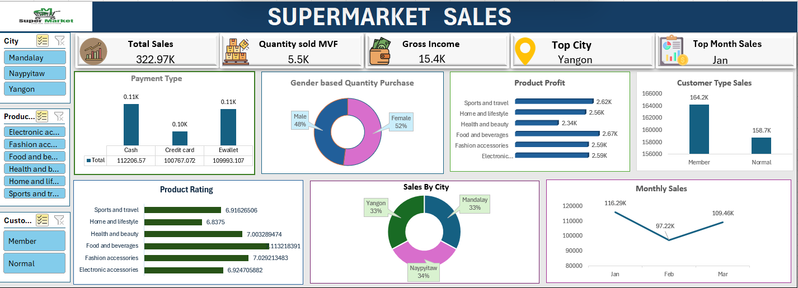

# 🛒 Supermarket Sales Dashboard

Analyze supermarket sales performance across cities, product categories, customer types, and payment methods.

🚀 Built to generate business insights and support data-driven decisions.

---

# 📌 Project Overview

This dashboard provides a complete analysis of supermarket sales data.  
It helps track:

- 💰 Total Sales  
- 📦 Quantity Sold  
- 💵 Gross Income  
- 🌍 Top Performing City  
- 📅 Best Sales Month  
- 🛍 Product Performance  
- 👥 Customer Behavior  
- 💳 Payment Trends  

---

# 🖼 Dashboard Preview

---

# 🎯 Key KPIs

| KPI | Value |
|-----|-------|
| 💰 Total Sales | **322.97K** |
| 📦 Quantity Sold | **5.5K** |
| 💵 Gross Income | **15.4K** |
| 🌍 Top City | **Yangon** |
| 📅 Top Sales Month | **January** |

---

# 📈 Dashboard Insights

---

## 💳 Payment Type Analysis

- Cash and E-wallet are the most preferred payment methods.
- Credit card usage is slightly lower than other payment methods.
- Payment distribution is almost balanced.

### Key Points:
✅ Cash Sales: **112.2K**  
✅ Credit Card Sales: **100.7K**  
✅ E-wallet Sales: **109.9K**

---

## 👨‍🦱👩 Gender-Based Quantity Purchase

- Female customers purchased slightly more products than male customers.
- Sales contribution is nearly balanced.

### Key Points:
👩 Female: **52%**  
👨 Male: **48%**

---

## 💹 Product Profit Analysis

This chart shows profit generated by each product category.

### Key Insights:
🏆 Highest Profit: **Food & Beverages (2.67K)**  
🥈 Sports & Travel: **2.62K**  
🥉 Home & Lifestyle: **2.56K**

Observation:
- Food & Beverage products are highly profitable.
- Health & Beauty contributes the least profit.

---

## 👥 Customer Type Sales

Comparison of sales between Member and Normal customers.

### Key Insights:
👑 Members generate higher sales than normal customers.

- Member Sales: **164.2K**
- Normal Sales: **158.7K**

Observation:
- Membership programs positively impact revenue.

---

## ⭐ Product Rating Analysis

Average customer ratings across product categories.

### Key Insights:
🏆 Highest Rated Category: **Food & Beverages**  
📈 Most categories received ratings above **6.8**

Observation:
- Customer satisfaction is strong across all categories.

---

## 🌍 Sales by City

Sales contribution from each city.

### Key Insights:
- Sales distribution is almost equal across all cities.

| City | Contribution |
|------|-------------|
| Mandalay | 33% |
| Yangon | 33% |
| Naypyitaw | 34% |

Observation:
- No city dominates significantly.
- Business performance is balanced geographically.

---

## 📅 Monthly Sales Trend

Monthly sales performance comparison.

### Key Insights:
📈 January recorded highest sales  
📉 February saw a decline  
📈 March recovered again  

| Month | Sales |
|-------|-------|
| Jan | 116.29K |
| Feb | 97.22K |
| Mar | 109.46K |

Observation:
- Sales dipped in February but improved in March.

---

# 🛠 Tools Used
 
- 🧹 Data Cleaning  
- 📈 Data Visualization  
- 📉 Dashboard Design  
- 📂 Excel Dataset  

---

# 🎨 Dashboard Features

✅ Interactive Filters / Slicers  
- City  
- Product Line  
- Customer Type  

✅ KPI Cards  

✅ Business Insights  

✅ Clean Visual Design  

---

# 📚 Business Recommendations

### Recommendation 1
Increase promotions in **February** to avoid sales drops.

### Recommendation 2
Focus on **Food & Beverage products** as they generate maximum profit.

### Recommendation 3
Encourage more customers to become **Members** through loyalty programs.

### Recommendation 4
Promote **Credit Card offers** to improve usage.

---

# 🚀 Project Goal

The goal of this dashboard is to transform raw supermarket sales data into actionable insights that help businesses:

- Improve profitability  
- Understand customer behavior  
- Optimize product strategy  
- Make better decisions  

---

Contact Me

👤 Name: Taniya Kaushal

📧 Email: taniyakaushal513@gmail.com

💼 LinkedIn:www.linkedin.com/in/taniya-k-826856274

💻 GitHub:https://github.com/Taniya-a11y/SUPERMARKET-SALES-DASHBOARD

